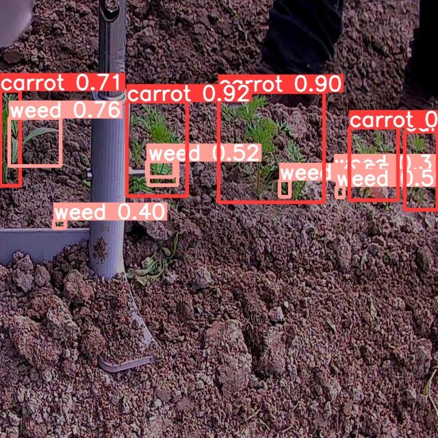
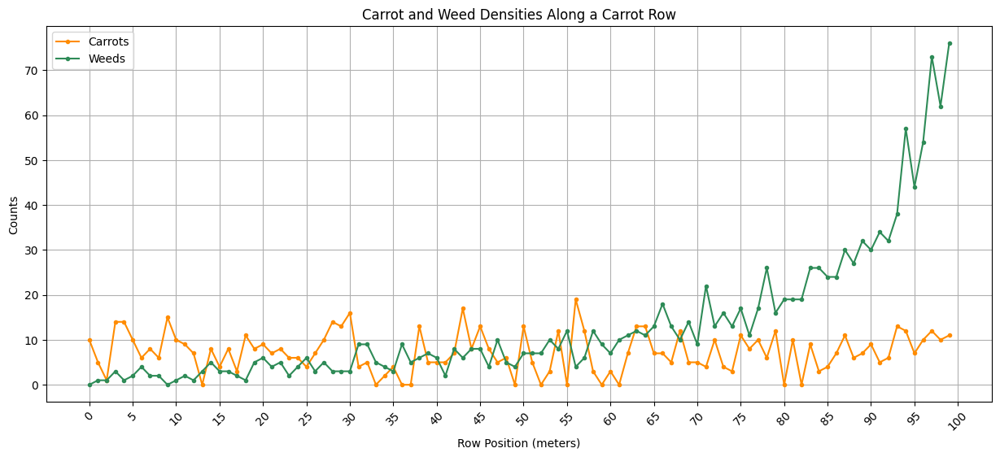

# GRowBot

This repository contains the code and resources for the GRowBot project. The GRowBot is an autonomous robot designed for precision application of fertilisers and herbicides, as well as efficient management of crops in agriculture. The project is in its early stages, with the current focus on developing computer vision algorithms for crop and weed counting, and disease classification.

## Project Overview

The GRowBot project aims to:

1. Optimise the use of fertilisers and herbicides in agriculture by implementing precision farming techniques.
2. Reduce the environmental impact of agrochemicals through targeted application.
3. Increase crop yields and improve overall farm management.

## Technologies Used

- Python
- TensorFlow
- OpenCV
- Jupyter Notebook

## Installation and Usage
```
git clone https://github.com/trow-land/GRowBot.git
cd GRowBot
pip install -r requirements.txt
python main.py
```
## Current Progress

The project currently includes a few Jupyter Notebook files with the following functionalities:

1. Training a YOLOv8 (You Only Look Once) model for crop and weed detection and inference on a test set.
2. Training an SSD (Single Shot MultiBox Detector) model for crop and weed detection.
3. Integrating hypothetical NPK nutrient testing results and providing fertilisation ratio recommendations based on test results.

Inference examples can be seen in [images](https://github.com/trow-land/Computer-Vision-Projects/tree/main/GRowBot/images).



## Dataset Citation

The dataset used in this project was modified from 'late-stage Dataset' by Med Chebbi, published on Roboflow Universe. More details can be found at the dataset's [webpage](https://universe.roboflow.com/med-chebbi/late-stage).

## Crop and Weed Density



This graph shows the output counts from inference on the 100 images in the test set. To simulate the GRowBot moving along a 100m row of carrots, the test images were loosely ordered so that there were more weed annotations towards the back. This would simulate a situation where there are more weeds at one end where perhaps seeds have blown in from an adjacent field.

## Future Work

The GRowBot project is still in its early stages, and there are plans to further develop the project, including:

- Transferring to Python files once a local GPU enabled machine has been bought.
- Finding a crop/dataset so that the bounding box can be passed to a disease classification network.
- Further testing and hyperparameter tuning with these and other object detection algorithms.

## License and Acknowledgements

This project is licensed under the MIT License. Please see the [License](https://www.mit.edu/~amini/LICENSE.md) file for more details.
